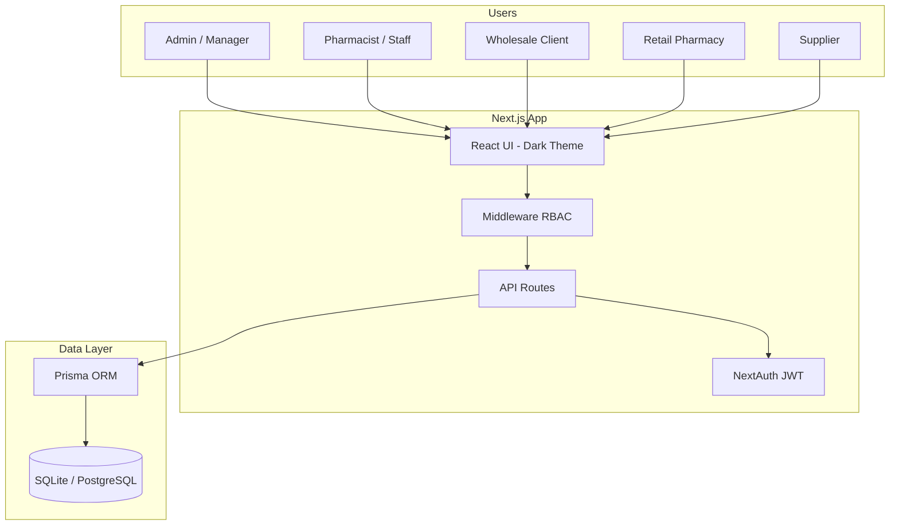

# Architecture — Pharmacy Supply Management

## System overview

## Role matrix

| Feature | Admin | Staff | Client | Retailer | Supplier |
|---------|:-----:|:-----:|:------:|:--------:|:--------:|
| Dashboard & reports | ✓ | ✓ | — | — | limited |
| Add/edit medicines | ✓ | view | — | — | — |
| Manual sale orders | ✓ | ✓ | — | — | — |
| Fulfill online orders | ✓ | ✓ | — | — | — |
| Supplier purchases | ✓ | ✓ | — | — | — |
| Manage clients | ✓ | — | — | — | — |
| Manage retailers | ✓ | — | — | — | — |
| Manage suppliers | ✓ | — | — | — | — |
| Wholesale catalog & cart | — | — | ✓ | — | — |
| Retail catalog & cart | — | — | — | ✓ | — |
| View deliveries / products | — | — | — | — | ✓ |

## Entity model

- **User** — auth + role (ADMIN, STAFF, CLIENT, RETAILER, SUPPLIER); optional link to Client, Retailer, or Supplier
- **Client** — wholesale organization; portal user optional
- **Retailer** — retail pharmacy / shop; portal user optional; orders use retail pricing
- **Supplier** — vendor master data
- **Medicine** — dual pricing (retail/wholesale), stock, expiry, threshold, supplier
- **Order** + **OrderItem** — sales; linked to client and/or retailer; stock decremented on create
- **Purchase** — inbound stock from supplier; increments medicine quantity

## Portal routes

| Role | Home | Routes |
|------|------|--------|
| Client | `/catalog` | `/catalog`, `/cart`, `/my-orders` |
| Retailer | `/retailer/catalog` | `/retailer/catalog`, `/retailer/cart`, `/retailer/my-orders` |
| Supplier | `/supplier/dashboard` | `/supplier/dashboard`, `/supplier/deliveries`, `/supplier/products` |

## Core flow implementation

| Flow | Entry point | Stock impact |
|------|-------------|--------------|
| Add medicine | `POST /api/medicines` | Set on create |
| Manual sale | `POST /api/orders` | Decrement per line |
| Wholesale portal order | `POST /api/orders` (WHOLESALE) | Decrement per line |
| Retail portal order | `POST /api/orders` (RETAIL) | Decrement per line |
| Supplier purchase | `POST /api/purchases` | Increment qty |
| Cancel order | `PATCH /api/orders/:id` | Restore qty |

## Alerts

- **Low stock**: `stockQuantity <= lowStockThreshold`
- **Expiry**: within 90 days (warning) or past date (expired)
- Surfaced on `/alerts` and dashboard metrics

## Design system

| Token | Value | Usage |
|-------|-------|-------|
| Background | `#0F172A` | Page bg |
| Surface | `#1E293B` | Cards, sidebar |
| Accent | `#10B981` | Health/pharma highlights |
| Primary | `#3B82F6` | Actions, links |

## Production checklist

1. PostgreSQL via Supabase (`DATABASE_URL` + optional `DIRECT_URL`)
2. Set strong `AUTH_SECRET` and HTTPS `NEXTAUTH_URL`
3. Run `npm run db:supabase` once to push schema and seed
4. Change demo passwords before go-live
