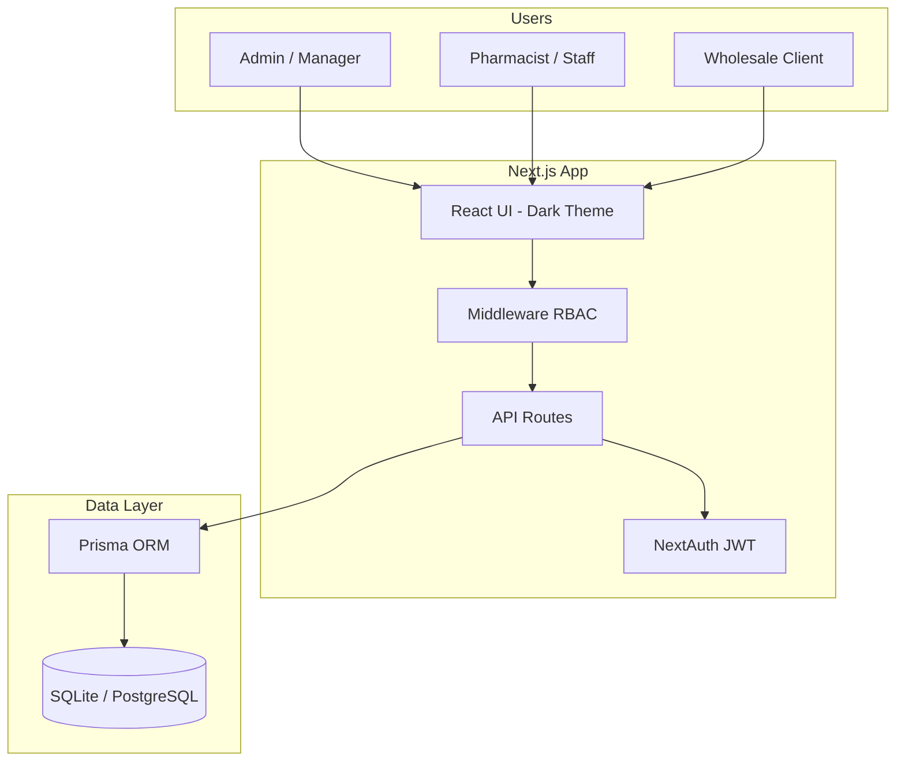

# Architecture — Pharmacy Supply Management

## System overview

## Role matrix

| Feature | Admin | Staff | Client |
|---------|:-----:|:-----:|:------:|
| Dashboard & reports | ✓ | ✓ | — |
| Add/edit medicines | ✓ | view | — |
| Manual sale orders | ✓ | ✓ | — |
| Fulfill online orders | ✓ | ✓ | — |
| Supplier purchases | ✓ | ✓ | — |
| Manage clients & logins | ✓ | — | — |
| Browse catalog (wholesale price) | — | — | ✓ |
| Place online orders | — | — | ✓ |

## Entity model

- **User** — auth + role (ADMIN, STAFF, CLIENT); optional link to Client
- **Client** — wholesale organization; portal user optional
- **Supplier** — vendor master data
- **Medicine** — dual pricing (retail/wholesale), stock, expiry, threshold, supplier
- **Order** + **OrderItem** — sales; stock decremented on create; restored on cancel
- **Purchase** — inbound stock from supplier; increments medicine quantity

## Core flow implementation

| Flow | Entry point | Stock impact |
|------|-------------|--------------|
| Add medicine | `POST /api/medicines` | Set on create |
| Manual sale | `POST /api/orders` | Decrement per line |
| Client order | `POST /api/orders` (WHOLESALE) | Same as sale |
| Supplier purchase | `POST /api/purchases` | Increment qty |
| Cancel order | `PATCH /api/orders/:id` | Restore qty |

## Alerts

- **Low stock**: `stockQuantity <= lowStockThreshold`
- **Expiry**: within 90 days (warning) or past date (expired)
- Surfaced on `/alerts` and dashboard metrics via `/api/alerts` and `/api/dashboard`

## Design system

| Token | Value | Usage |
|-------|-------|-------|
| Background | `#0F172A` | Page bg |
| Surface | `#1E293B` | Cards, sidebar |
| Accent | `#10B981` | Health/pharma highlights |
| Primary | `#3B82F6` | Actions, links |
| Typography | System sans, bold headings | Hierarchy |

## Production checklist

1. Switch Prisma datasource to PostgreSQL
2. Set strong `AUTH_SECRET` and HTTPS `NEXTAUTH_URL`
3. Add invoice PDF generation
4. Email notifications for order status
5. Audit log for stock movements
6. Rate limiting on auth endpoints

## Phase 2 ideas

- Barcode scanning for inventory
- Multi-location warehouses
- Payment integration
- Regulatory batch/lot tracking
- Advanced reporting (CSV export, date ranges)
